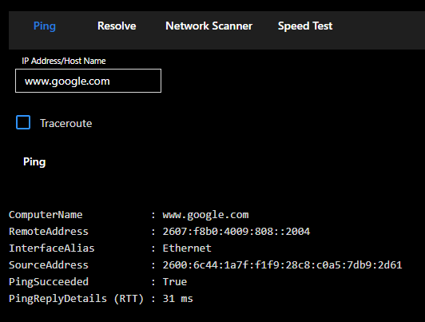
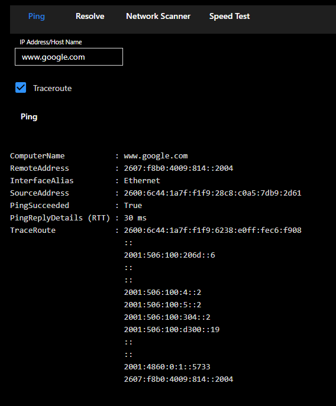
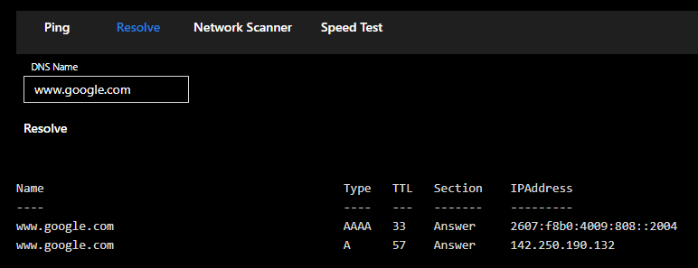
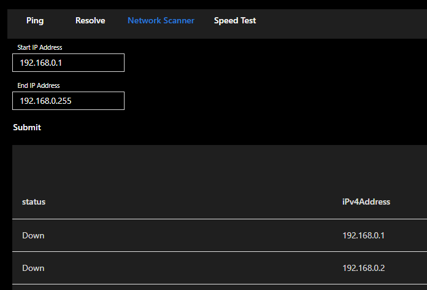
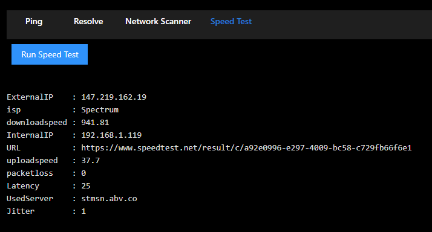

# Network Utilities App

## Features

### Ping

Ping a host. 

### Traceroute

Run a traceroute against a host.

### Resolve

Resolve a host name to an IP address.

### Network Scan

Scan a network for hosts.

### Speed Test 

Test the speed of your internet connection with Speedtest.net

## Requirements

- PowerShell Universal 4.0 or later